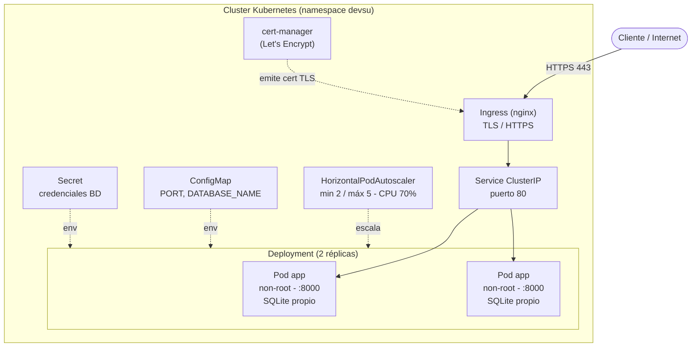
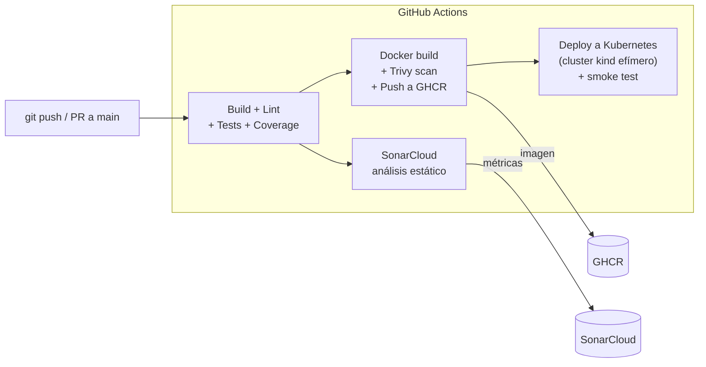

# Demo DevOps NodeJS — Prueba Técnica DevOps (Devsu)

API REST de usuarios (Node.js + Express) **dockerizada**, con **pipeline CI/CD**, desplegada en **Kubernetes** (local con minikube y en la nube con **GKE**), infraestructura como código con **Terraform** y **HTTPS** con certificado válido de Let's Encrypt.

| | |
|---|---|
| 🌐 **Endpoint público (HTTPS)** | https://34-41-108-49.sslip.io/api/users |
| 📦 **Repositorio** | https://github.com/gpleyton/gpleyton_devsu |
| ⚙️ **Pipeline (GitHub Actions)** | https://github.com/gpleyton/gpleyton_devsu/actions |
| 🐳 **Imagen (GHCR)** | https://github.com/gpleyton/gpleyton_devsu/pkgs/container/gpleyton_devsu |
| 🔍 **Análisis (SonarCloud)** | https://sonarcloud.io/project/overview?id=gpleyton_devsu |

> ⚠️ El endpoint público depende de un cluster de GKE que puede haberse destruido para evitar costos. Si no responde, ver [Despliegue en GKE](#despliegue-en-gke-google-cloud) para recrearlo, o las evidencias en [`docs/evidencias/`](docs/evidencias/).

---

## Tabla de contenido
- [La aplicación](#la-aplicación)
- [Arquitectura](#arquitectura)
- [Flujo CI/CD](#flujo-cicd)
- [Cómo ejecutar](#cómo-ejecutar)
  - [Local](#1-local-nodejs)
  - [Docker](#2-docker)
  - [Kubernetes (minikube)](#3-kubernetes-minikube)
  - [Despliegue en GKE](#despliegue-en-gke-google-cloud)
  - [Terraform (IaC)](#infraestructura-como-código-terraform)
- [Pipeline CI/CD](#pipeline-cicd-detalle)
- [Probar la API](#probar-la-api)
- [Decisiones técnicas](#decisiones-técnicas)
- [Requisitos del ejercicio](#requisitos-del-ejercicio)
- [Estructura del repositorio](#estructura-del-repositorio)

---

## La aplicación

API REST sencilla de gestión de usuarios. Un usuario tiene `id` (autogenerado), `dni` (único) y `name`.

| Método | Ruta | Descripción | Respuestas |
|---|---|---|---|
| `GET` | `/api/users` | Lista todos los usuarios | `200` |
| `GET` | `/api/users/:id` | Obtiene un usuario | `200` / `404` si no existe |
| `POST` | `/api/users` | Crea un usuario (`dni`, `name`) | `201` / `400` si dni duplicado o datos inválidos |
| `GET` | `/api/health` | Liveness probe (proceso vivo) | `200` `{"status":"UP"}` |
| `GET` | `/api/health/ready` | Readiness probe (BD disponible) | `200` / `503` |

**Stack:** Node.js 18 · Express · Sequelize · SQLite · Yup (validación) · Jest (tests).

---

## Arquitectura

Arquitectura del despliegue en Kubernetes (aplica a minikube y a GKE):



**Probes:** liveness → `/api/health`, readiness → `/api/health/ready`.
**Seguridad del pod:** usuario non-root, `readOnlyRootFilesystem`, capabilities `drop: ALL`, volumen efímero para la BD.

---

## Flujo CI/CD



---

## Cómo ejecutar

### 1. Local (Node.js)
Requiere Node.js 18.

```bash
cp .env.example .env
npm install
npm test           # tests unitarios
npm run test:coverage
npm start          # http://localhost:8000/api/users
```

### 2. Docker
```bash
docker compose up --build
# o manualmente:
docker build -t demo-devops-nodejs:local .
docker run -p 8000:8000 demo-devops-nodejs:local
```
Imagen **multi-stage** sobre `node:18-alpine`, usuario **non-root** y `HEALTHCHECK` a `/api/health`.

### 3. Kubernetes (minikube)
```bash
minikube start
minikube addons enable ingress
minikube addons enable metrics-server
minikube image load demo-devops-nodejs:local

# Opción A: manifiestos planos
kubectl apply -f k8s/

# Opción B: Helm (recomendado)
helm upgrade --install demo helm/demo-devops-nodejs -n devsu --create-namespace \
  --set image.repository=demo-devops-nodejs --set image.tag=local --set image.pullPolicy=Never
```

### Despliegue en GKE (Google Cloud)
1. Crear la infraestructura con [Terraform](#infraestructura-como-código-terraform).
2. Conectar `kubectl` y publicar la imagen:
   ```bash
   gcloud container clusters get-credentials demo-devops-cluster --zone us-central1-a --project devsu-demo-devops-gp
   AR=us-central1-docker.pkg.dev/devsu-demo-devops-gp/demo-devops-nodejs/demo-devops-nodejs
   docker buildx build --platform linux/amd64 -t $AR:latest --push .
   ```
3. Instalar ingress-nginx y cert-manager (HTTPS) y desplegar con Helm:
   ```bash
   helm repo add ingress-nginx https://kubernetes.github.io/ingress-nginx
   helm repo add jetstack https://charts.jetstack.io && helm repo update
   helm upgrade --install ingress-nginx ingress-nginx/ingress-nginx -n ingress-nginx --create-namespace --set controller.service.type=LoadBalancer
   helm upgrade --install cert-manager jetstack/cert-manager -n cert-manager --create-namespace --set crds.enabled=true
   kubectl apply -f k8s/tls/clusterissuer.yaml
   helm upgrade --install demo helm/demo-devops-nodejs -n devsu --create-namespace -f helm/demo-devops-nodejs/values-gke.yaml
   ```
   El host del Ingress usa `sslip.io` apuntando a la IP del LoadBalancer de nginx, y cert-manager emite el certificado de Let's Encrypt automáticamente. Evidencias en [`docs/evidencias/gke.md`](docs/evidencias/gke.md).

### Infraestructura como Código (Terraform)
Aprovisiona en GCP: APIs, **Artifact Registry** y un cluster **GKE**. Detalle en [`terraform/README.md`](terraform/README.md).

```bash
cd terraform
cp terraform.tfvars.example terraform.tfvars   # poner tu project_id
terraform init
terraform apply      # ⚠️ crea recursos que cuestan dinero
terraform destroy    # al terminar, para dejar de pagar
```

---

## Pipeline CI/CD (detalle)

Definido como código en [`.github/workflows/ci-cd.yml`](.github/workflows/ci-cd.yml). Se ejecuta en cada push/PR a `main`:

| Job | Pasos |
|---|---|
| **build-test** | `npm ci` → ESLint → tests unitarios → **code coverage** (lcov) |
| **sonarcloud** | Análisis estático de código (SonarCloud) usando el reporte de cobertura |
| **docker** | Build de imagen → **escaneo de vulnerabilidades (Trivy)** → push a **GHCR** (`sha` + `latest`) |
| **deploy** | Crea un cluster **kind** efímero → despliega con Helm (2 réplicas) → **smoke test** de los endpoints |

El despliegue a Kubernetes se valida en un cluster `kind` dentro del runner (100% reproducible en la nube, sin infraestructura propia).

---

## Probar la API

```bash
# Salud
curl https://34-41-108-49.sslip.io/api/health

# Crear usuario
curl -X POST https://34-41-108-49.sslip.io/api/users \
  -H 'Content-Type: application/json' \
  -d '{"dni":"1234567890","name":"Juan Perez"}'

# Listar
curl https://34-41-108-49.sslip.io/api/users
```

También puedes importar la colección de **Postman** en [`docs/api/`](docs/api/) o usar el archivo `requests.http` con la extensión REST Client de VS Code.

---

## Decisiones técnicas

- **Imagen Docker multi-stage + non-root + healthcheck:** imagen liviana (`node:18-alpine`), build reproducible con lockfile, ejecución como usuario `node`, `readOnlyRootFilesystem` y `HEALTHCHECK` — buenas prácticas de seguridad y producción.
- **Helm chart además de manifiestos planos:** los manifiestos en `k8s/` son fáciles de revisar; el chart en `helm/` parametriza el despliegue (imagen, recursos, TLS, HPA) y se reutiliza en CI, minikube y GKE.
- **HTTPS con ingress-nginx + cert-manager + Let's Encrypt + sslip.io:** certificado válido y gratuito sin necesidad de comprar dominio. `sslip.io` resuelve la IP a un hostname (las CA no emiten certificados para IPs).
- **GHCR como registry:** integrado al repositorio público, sin cuentas externas (usa el `GITHUB_TOKEN`).
- **Validación del deploy con kind en CI:** demuestra el despliegue a Kubernetes de forma reproducible sin depender de un cluster propio.
- **Base de datos SQLite por réplica (limitación consciente):** la app base usa SQLite en fichero local y recrea el esquema al iniciar (`sync force`). Con 2 réplicas, **cada pod tiene su propia BD**, por lo que un `POST` y un `GET` pueden caer en réplicas distintas y devolver datos distintos. Es **aceptable para esta prueba** (no se pide BD persistente/compartida). **En producción** se usaría una base de datos externa gestionada (Cloud SQL / PostgreSQL) compartida entre réplicas, y se quitaría el `sync force`.
- **Mono-repo:** el enunciado pide un único repositorio; se mantiene la infraestructura (k8s, helm, terraform) en carpetas separadas y limpias, de modo que migrar a repos separados (app vs infra) sería trivial en un escenario real.

---

## Requisitos del ejercicio

| Requerimiento | Estado | Dónde |
|---|---|---|
| Dockerizar (env vars, run user, port, healthcheck) | ✅ | `Dockerfile`, `docker-compose.yml` |
| Pipeline: Code Build | ✅ | job `build-test` |
| Pipeline: Unit Tests | ✅ | job `build-test` |
| Pipeline: Static Code Analysis | ✅ | job `sonarcloud` |
| Pipeline: Code Coverage | ✅ | job `build-test` (lcov) |
| Pipeline: Build & Push imagen | ✅ | job `docker` → GHCR |
| Pipeline: Vulnerability scan (opcional) | ✅ | Trivy en job `docker` |
| Desplegar en Kubernetes | ✅ | minikube + GKE |
| ≥ 2 réplicas + escalamiento horizontal (HPA) | ✅ | `k8s/deployment.yaml`, `k8s/hpa.yaml` |
| ConfigMap, Secret, Ingress | ✅ | `k8s/` |
| Deploy de K8s en el pipeline | ✅ | job `deploy` (kind) |
| Documentación + diagramas | ✅ | este README |
| **Extra:** IaC en proveedor público | ✅ | `terraform/` (GCP) |
| **Extra:** entorno público accesible | ✅ | GKE + HTTPS |
| **Extra:** DNS / certificado TLS | ✅ | sslip.io + Let's Encrypt |

> **Requisitos no cumplidos:** ninguno de los obligatorios. Única limitación conocida (documentada arriba): la BD SQLite no es compartida entre réplicas, por diseño de la app base.

---

## Estructura del repositorio

```
.
├── index.js, users/, shared/      # Aplicación Node.js (Express)
├── Dockerfile, docker-compose.yml # Contenedor
├── .github/workflows/ci-cd.yml    # Pipeline CI/CD
├── sonar-project.properties       # Config SonarCloud
├── k8s/                           # Manifiestos Kubernetes
│   ├── namespace, configmap, secret, deployment, service, ingress, hpa
│   └── tls/clusterissuer.yaml     # Let's Encrypt (cert-manager)
├── helm/demo-devops-nodejs/       # Helm chart (incl. values-gke.yaml)
├── terraform/                     # IaC para GCP (GKE + Artifact Registry)
└── docs/
    ├── api/                       # Colección Postman + requests.http
    └── evidencias/                # Evidencias de despliegue (minikube, GKE)
```

---

## Licencia
Aplicación base: Copyright © 2023 Devsu. Trabajo de DevOps para prueba técnica.
